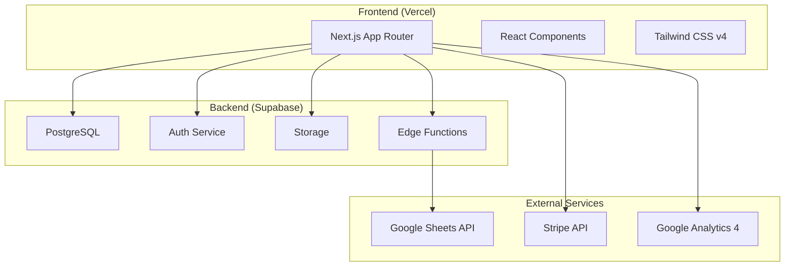

# 技術アーキテクチャ詳細

## 🏗️ システム全体構成



## 📁 ディレクトリ構造

```
matsuritools/
├── app/                      # Next.js App Router
│   ├── (auth)/              # 認証関連ページ
│   │   ├── login/
│   │   └── register/
│   ├── (dashboard)/         # ダッシュボード
│   │   ├── admin/          # 管理画面
│   │   └── user/           # ユーザー画面
│   ├── api/                # API Routes
│   ├── layout.tsx          # ルートレイアウト
│   └── page.tsx            # ホームページ
├── components/              # Reactコンポーネント
│   ├── ui/                 # 基本UIコンポーネント
│   ├── features/           # 機能別コンポーネント
│   └── layouts/            # レイアウトコンポーネント
├── lib/                     # ユーティリティ
│   ├── supabase/           # Supabase関連
│   ├── calculations/       # 期待値計算ロジック
│   └── utils/              # 汎用ユーティリティ
├── hooks/                   # カスタムフック
├── types/                   # TypeScript型定義
├── public/                  # 静的ファイル
├── styles/                  # グローバルスタイル
└── supabase/               # Supabase設定
    ├── migrations/         # DBマイグレーション
    └── functions/          # Edge Functions
```

## 🗄️ データベース設計

### テーブル構造

#### users（ユーザー）
```sql
CREATE TABLE users (
    id UUID PRIMARY KEY DEFAULT uuid_generate_v4(),
    email TEXT UNIQUE NOT NULL,
    role TEXT DEFAULT 'user',
    created_at TIMESTAMP DEFAULT NOW(),
    updated_at TIMESTAMP DEFAULT NOW()
);
```

#### packs（弾情報）
```sql
CREATE TABLE packs (
    id TEXT PRIMARY KEY,           -- 例: 24RP1
    name TEXT NOT NULL,            -- 弾名
    release_date DATE,             -- 発売日
    box_price INTEGER,             -- 定価
    packs_per_box INTEGER,         -- 1箱のパック数
    cards_per_pack INTEGER,        -- 1パックのカード数
    is_active BOOLEAN DEFAULT true,
    created_at TIMESTAMP DEFAULT NOW()
);
```

#### rarities（レアリティ）
```sql
CREATE TABLE rarities (
    id SERIAL PRIMARY KEY,
    pack_id TEXT REFERENCES packs(id),
    name TEXT NOT NULL,            -- レアリティ名
    cards_per_box DECIMAL,         -- 箱あたり封入枚数
    total_cards INTEGER,           -- 総カード種類数
    color TEXT                     -- 表示色
);
```

#### cards（カード情報）
```sql
CREATE TABLE cards (
    id TEXT PRIMARY KEY,           -- 例: DM24RP1-001
    pack_id TEXT REFERENCES packs(id),
    rarity_id INTEGER REFERENCES rarities(id),
    card_number TEXT,
    name TEXT NOT NULL,
    image_url TEXT,
    box_rate DECIMAL,              -- 箱封入率
    parameters JSONB,              -- 可変パラメータ
    created_at TIMESTAMP DEFAULT NOW()
);
```

#### access_codes（アクセスコード）
```sql
CREATE TABLE access_codes (
    code TEXT PRIMARY KEY,         -- 12桁コード
    pack_id TEXT REFERENCES packs(id),
    valid_from TIMESTAMP,
    valid_until TIMESTAMP,
    max_uses INTEGER,
    current_uses INTEGER DEFAULT 0,
    created_by UUID REFERENCES users(id),
    created_at TIMESTAMP DEFAULT NOW()
);
```

#### user_codes（ユーザー保有コード）
```sql
CREATE TABLE user_codes (
    user_id UUID REFERENCES users(id),
    code TEXT REFERENCES access_codes(code),
    activated_at TIMESTAMP DEFAULT NOW(),
    PRIMARY KEY (user_id, code)
);
```

## 🔐 認証フロー

### 1. 新規登録/ログイン
```typescript
// Supabase Auth使用例
const { data, error } = await supabase.auth.signUp({
    email: 'user@example.com',
    password: 'password123',
});

// OAuthログイン
const { data, error } = await supabase.auth.signInWithOAuth({
    provider: 'google' | 'apple' | 'twitter',
});
```

### 2. アクセスコード検証
```typescript
// アクセスコード検証フロー
async function validateAccessCode(code: string, userId: string) {
    // 1. コードの存在確認
    // 2. 有効期限チェック
    // 3. 使用上限チェック
    // 4. ユーザーへの紐付け
}
```

## 💰 期待値計算ロジック

### 基本計算式
```typescript
interface CalculationInput {
    boxPrice: number;          // ボックス購入価格
    cardPrices: Map<string, number>;  // カードID -> 買取価格
    cardRates: Map<string, number>;   // カードID -> 箱封入率
}

function calculateExpectedValue(input: CalculationInput): {
    expectedValue: number;     // 期待値
    profitProbability: number; // プラス確率
} {
    // 期待値 = Σ(カード買取価格 × 箱封入率)
    let expectedValue = 0;
    
    for (const [cardId, price] of input.cardPrices) {
        const rate = input.cardRates.get(cardId) || 0;
        expectedValue += price * rate;
    }
    
    // プラス確率は別途計算（単純な弾）または
    // Monte Carloシミュレーション（複雑な弾）
    const profitProbability = calculateProfitProbability(input);
    
    return { expectedValue, profitProbability };
}
```

### Monte Carloシミュレーション（Phase 3.x）
```typescript
// Web Workerで実行
function monteCarloSimulation(
    input: CalculationInput,
    iterations: number = 100000
): number {
    let profitCount = 0;
    
    for (let i = 0; i < iterations; i++) {
        const boxValue = simulateBoxOpening(input);
        if (boxValue >= input.boxPrice) {
            profitCount++;
        }
    }
    
    return (profitCount / iterations) * 100;
}
```

## 🎨 UI/UXアーキテクチャ

### コンポーネント設計方針
- **Atomic Design**: 小さく再利用可能なコンポーネント
- **Server Components優先**: パフォーマンス最適化
- **Suspense活用**: ローディング状態の管理

### 状態管理
```typescript
// グローバル状態管理
- Zustand: 軽量な状態管理
- React Query (TanStack Query): サーバー状態管理

// ローカル状態
- useState/useReducer: コンポーネント内状態
- React Hook Form: フォーム状態管理
```

## 🚀 デプロイ・CI/CD

### GitHub Actions設定
```yaml
name: Deploy to Vercel
on:
  push:
    branches: [main]
  pull_request:
    branches: [main]

jobs:
  test:
    runs-on: ubuntu-latest
    steps:
      - uses: actions/checkout@v3
      - uses: actions/setup-node@v3
        with:
          node-version: '20'
      - run: npm ci
      - run: npm test
      - run: npm run lint
      - run: npm run type-check
```

### 環境変数管理
```
開発環境: .env.local
ステージング: Vercel環境変数（Preview）
本番環境: Vercel環境変数（Production）
```

## 📊 パフォーマンス最適化

### 1. 画像最適化
- Next.js Image コンポーネント使用
- WebP形式への自動変換
- 遅延読み込み

### 2. バンドルサイズ最適化
- Dynamic Import活用
- Tree Shaking
- Code Splitting

### 3. キャッシュ戦略
- Static Generation（可能な限り）
- ISR（Incremental Static Regeneration）
- Supabaseクエリキャッシュ

## 🔒 セキュリティ対策

### 1. 認証・認可
- Supabase Row Level Security (RLS)
- JWTトークン検証
- CORS設定

### 2. データ検証
- Zodによる入力検証
- SQLインジェクション対策（Supabase準拠）
- XSS対策（React自動エスケープ）

### 3. API保護
- Rate Limiting
- APIキーの環境変数管理
- HTTPSの強制

## 📈 監視・ログ

### 1. エラー監視
- Vercel Analytics
- GCP Error Reporting
- カスタムエラーハンドリング

### 2. パフォーマンス監視
- Core Web Vitals追跡
- Google Analytics 4
- Real User Monitoring (RUM)

### 3. ログ管理
```typescript
// 構造化ログの例
logger.info('期待値計算実行', {
    userId: user.id,
    packId: pack.id,
    timestamp: new Date().toISOString(),
    result: calculationResult,
});
```

## 🔄 今後の拡張性

### スケーラビリティ
- Vercel Edge Functionsへの移行検討
- Supabaseの水平スケーリング
- CDN活用の拡大

### 機能拡張の準備
- プラグインアーキテクチャの検討
- APIのバージョニング戦略
- マルチテナント対応の設計

---

最終更新日：2025-07-23